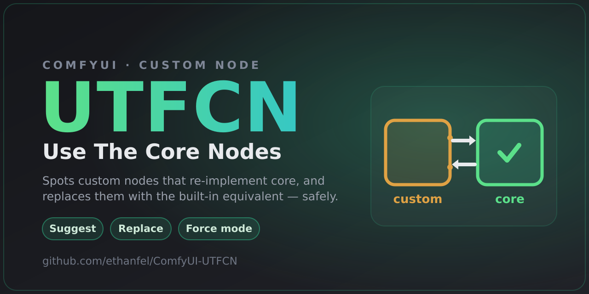

<p align="center">
  
</p>

# UTFCN — Use The F***ing Core Nodes

A ComfyUI companion that nudges your workflows back toward **core nodes**. Over
time a graph accumulates custom nodes that just re-implement things ComfyUI now
ships itself. UTFCN spots those and helps you swap them out — fewer dependencies,
more portable workflows.

It does three things:

1. **On add** — drop a custom node that has a core (or otherwise installed)
   equivalent and, depending on the mode, UTFCN either shows a quiet tip or
   (in **Force mode**) auto-replaces it with the equivalent on the spot.
2. **Replace across a workflow** — `Extensions ▸ UTFCN ▸ Replace custom nodes
   with core / available…` (also in the command palette). It scans the open
   graph and shows a **preview** of every swap before anything changes.
3. **Replace one node** — right-click any custom node ▸ **Replace with core /
   available**.

Nothing is ever swapped without your say-so, and the engine only rewires slots
it can move *losslessly* — anything it can't map is reported, not guessed.

## How it decides what's equivalent

The backend reads the live node registry (real `INPUT_TYPES` / `RETURN_TYPES`
and each node's source module) and ranks candidates in three tiers:

| Tier | Meaning | Auto-applied? |
|------|---------|---------------|
| **curated** | a hand-written rule in `mappings.json` / `user_mappings.json` | yes (verified) |
| **exact**   | identical input names+types and output types to a core/other-pack node | yes (verified) |
| **partial** | can structurally stand in (accepts all inputs, provides all outputs) but names/slots differ | suggestion only |

"Available" means core is preferred, and if there's no core match it will offer
an equivalent from a **different installed pack** as a fallback.

## Shipped equivalences

`mappings.json` ships a small, hand-verified set (each checked lossless against
the real core signatures):

- `GetImageSize+` (essentials) → core `GetImageSize`
- `MaskPreview+` (essentials) → core `MaskPreview`
- `BOOLConstant` / `INTConstant` / `FloatConstant` (KJNodes) → core
  `PrimitiveBoolean` / `PrimitiveInt` / `PrimitiveFloat`
- `Convert Masks to Images` / `Mask Invert` (WAS) → core `MaskToImage` /
  `InvertMask`

Rules for nodes you don't have installed are simply ignored. Everything else is
found live: exact-signature matches auto-apply, looser ones are suggested.

## Adding your own equivalences

To bless a partial match as safe, or to fix up slots whose names differ, add a
rule to **`user_mappings.json`** (merged over the shipped `mappings.json`,
survives updates):

```json
{
  "rules": {
    "SomeCustomNode": [
      {
        "to": "CoreNode",
        "note": "why they're equivalent (shown in the preview)",
        "inputs":  { "old_input": "new_input" },
        "widgets": { "old_widget": "new_widget" },
        "outputs": { "old_output": "new_output" }
      }
    ]
  }
}
```

List targets in preference order (put the core node first). Any slot you don't
list is matched by identical name, then by type + order. After editing, run
`Extensions ▸ UTFCN ▸ Refresh equivalence index` (no restart needed).

## Settings

**UTFCN ▸ On add ▸ When adding a custom node that has a core / available
equivalent:**

- **Off** — do nothing.
- **Suggest** (default) — show a tip pointing at the equivalent.
- **Force (auto-replace with core)** — immediately swap it for the equivalent.
  Force only ever applies **verified** matches (curated or exact-signature); it
  never auto-applies a heuristic guess, and it never fires while you're opening
  or importing a workflow — only on nodes *you* add. Undo with Ctrl+Z.

## Install

Clone into `ComfyUI/custom_nodes/` and restart ComfyUI:

```
git clone https://github.com/ethanfel/ComfyUI-UTFCN
```

No Python dependencies. The node adds a single read-only server route
(`/utfcn/scan`) and a frontend extension.

## License

GPL-3.0-or-later. See [LICENSE](LICENSE).
